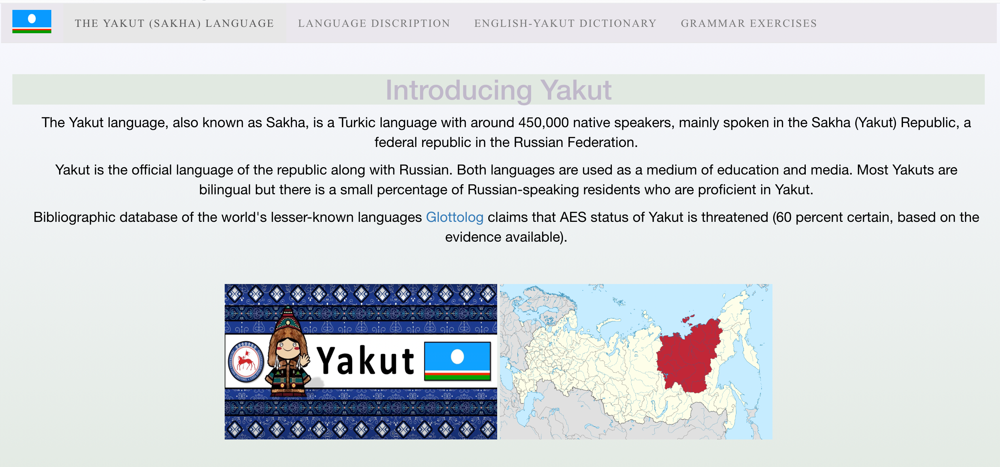
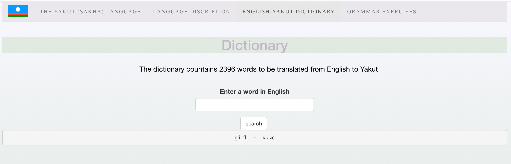
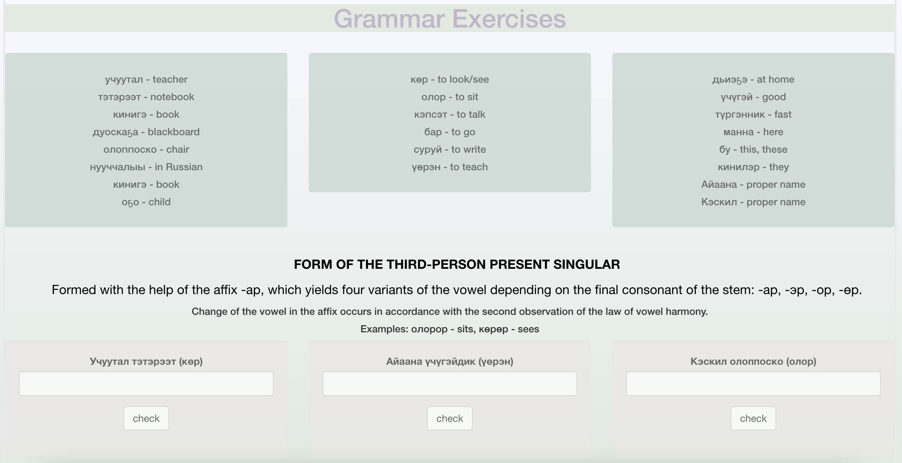

# Yakut_Grammar_Exercises

The project is divided into [Language Description](#language-description), [English-Yakut Dictionary](#dict) and [Grammar Exercises](#exer).
The application can be accesses [here](https://tatiana-merz.shinyapps.io/Yakut_Grammar/) or cloned from the repository and opened as a Shiny App with RStudio.

### Language Description 

### English-Yakut Dictionary 

### Grammar Exercises 

